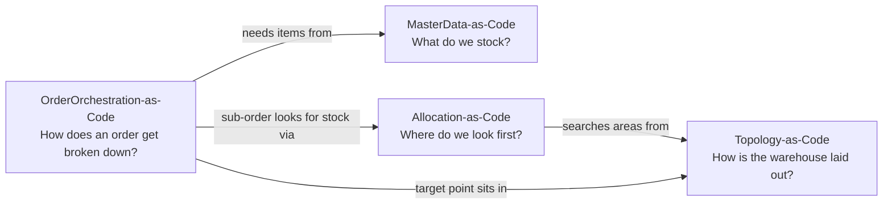
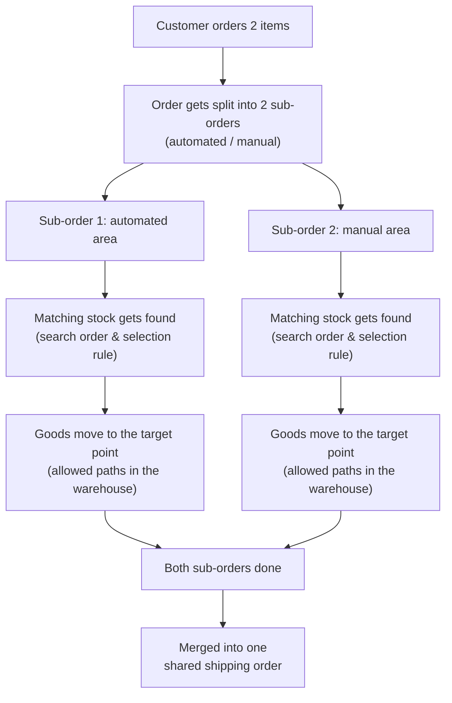

# Warehouse-as-Code – an introduction for the business side

*[Auf Deutsch lesen](business-overview.de.md)*

This page explains what the "Warehouse-as-Code" repo family is about –
**no code, YAML, or technical jargon**. It's for anyone who wants to
understand what's described here and why, without editing the files
themselves. For the technical view (developers, architects), each repo's
own `README.md` remains the authoritative source – this page is a map, not
a replacement for it.

## What is this actually about?

Think of it as a **blueprint**, not a **construction log**.

- A blueprint fixes where the walls stand, where the doors are, which
  rooms exist, and what the rules are for renovating. It changes rarely
  and gets carefully reviewed.
- A construction log, by contrast, records what's actually happening
  today: who's on site right now, which room is currently occupied, what
  got delivered today. That changes constantly.

The repos in this family are exclusively **blueprint** – they describe how
a warehouse should be built and what rules it should run by. The actual
day-to-day business (current stock, live orders, which worker is doing
what right now) runs in the real warehouse management system (WMS) and is
deliberately **not** captured here.

The benefit: because the blueprint lives as plain text in a version
control system, every change is traceable, reviewable, and machine-checked
for contradictions – just like a blueprint that several architects need to
agree on together.

## The four building blocks

The overall "map" is split into four areas. Each answers its own question:

| Building block | Answers the question | In plain terms |
|---|---|---|
| **Topology-as-Code** | How is our warehouse laid out? | Racks, aisles, automation cells (e.g. an AutoStore grid), doors – and which goods movements between which areas are allowed at all. |
| **MasterData-as-Code** | What do we actually stock? | Which items exist, how they're packaged (piece → case → pallet), who supplies them, whether they're seasonal or being discontinued. |
| **OrderOrchestration-as-Code** | How does an order get worked through? | The rules for how an incoming order gets broken into sub-orders, and what has to happen for it to count as done. |
| **Allocation-as-Code** | Where do we look first when we need stock? | The order in which warehouse areas get searched for matching stock, and the principle used to pick among matches (e.g. oldest shelf life first). |

These four building blocks build on each other. An order (orchestration)
needs an item (master data), which gets searched for somewhere in the
warehouse (allocation), and the goods then move along the allowed paths
through the physical warehouse (topology):

## A day in the warehouse, worked through

The interplay is easiest to see through a concrete (simplified) example,
the same one used as a worked illustration in the repos themselves:

1. A customer orders two items in one order.
2. One item sits in the automated area (AutoStore), the other in the
   manually operated area. Because the two areas work differently, the
   order gets split into two sub-orders.
3. For each sub-order, matching stock gets found – following the
   configured search rules.
4. The goods move along the allowed paths to their respective target
   point.
5. Once both sub-orders are done, a rule kicks in that merges them into
   one shared shipping order.

Every arrow in this picture corresponds to a rule stored somewhere in one
of the four building blocks – but nobody has to read the rule itself to
understand the overall flow.

## Why split this across four separate "blueprints"?

Because the four questions need answering at different frequencies, by
different people:

- **The physical structure** (where the racks stand) changes rarely –
  only during a rebuild – and gets reviewed accordingly strictly.
- **The process rules** (e.g. how an order gets split, or in what order
  stock gets searched) change often, because logistics planning reacts to
  them – so review is deliberately looser.
- **Item master data** changes per new product, but its basic shape stays
  stable.

This separation is deliberate, so nobody accidentally mixes a rare,
consequential change (e.g. to the warehouse structure) with an everyday
one (e.g. a new search rule).

## Important: what is **not** described here

Just like a blueprint doesn't show who walks through which door today,
these repos do **not** show:

- the actual current warehouse stock,
- live, real orders and their current status,
- which concrete task is currently assigned to which worker or vehicle,
- workforce scheduling,
- yard management (trucks, dock doors, time slots),
- optimizing which item sits in the most efficient location (slotting).

All of that lives in the real, running warehouse management system – not
in these repos. That's a deliberate decision, not a gap.

## What's still being worked on?

- So far there's only the **search strategy** for stock
  (Allocation-as-Code) – the actual stock and reservation state itself
  isn't captured anywhere in this repo family yet.
- **Wave/batch planning** (how multiple orders get bundled and worked
  through together) hasn't been touched at all yet.
- There's no automatic cross-check yet between the four building blocks
  (e.g.: does an order really reference an item that exists in the master
  data?). A separate test project currently only spot-checks this by
  actually "playing through" the rules.

## Where can I find more?

- The technical overview and current status of every area: this repo's
  own [`README.md`](../README.md).
- For details on a single building block: the respective `README.md` in
  [`Topology-as-Code`](https://github.com/rhinos07/Topology-as-Code),
  [`MasterData-as-Code`](https://github.com/rhinos07/MasterData-as-Code),
  [`OrderOrchestration-as-Code`](https://github.com/rhinos07/OrderOrchestration-as-Code),
  and [`Allocation-as-Code`](https://github.com/rhinos07/Allocation-as-Code).
- Building an actual WMS runtime against these repos:
  [`wms-implementation-guide.md`](wms-implementation-guide.md) – the
  technical counterpart to this page.
