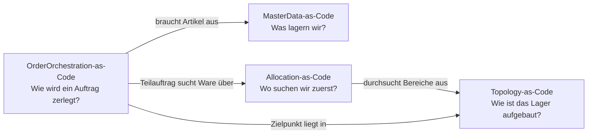
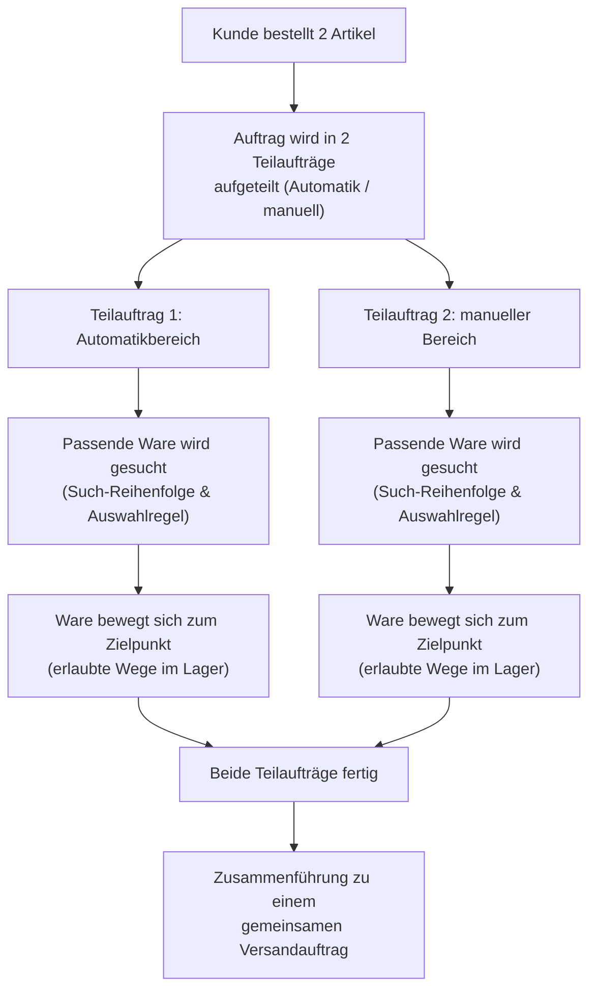

# Warehouse-as-Code – eine Einführung für den Fachbereich

Diese Seite erklärt, worum es in der "Warehouse-as-Code"-Repo-Familie geht –
**ohne Code, YAML oder Technik-Jargon**. Sie richtet sich an alle, die
verstehen wollen, was hier beschrieben wird und warum, aber nicht selbst
Dateien darin bearbeiten. Für die technische Sicht (Entwickler:innen,
Architekt:innen) bleibt die jeweilige `README.md` der einzelnen Repos die
maßgebliche Quelle – diese Seite ist eine Landkarte, kein Ersatz dafür.

## Worum geht es hier eigentlich?

Man kann sich das Ganze wie einen **Bauplan** vorstellen, nicht wie ein
**Bautagebuch**.

- Ein Bauplan legt fest: Wo stehen die Wände, wo sind die Türen, welche
  Räume gibt es, welche Regeln gelten für den Umbau. Er ändert sich selten
  und wird sorgfältig geprüft.
- Ein Bautagebuch dagegen hält fest, was heute tatsächlich passiert: Wer
  ist gerade auf der Baustelle, welcher Raum ist gerade belegt, was wurde
  heute geliefert. Das ändert sich ständig.

Die Repos in dieser Familie sind ausschließlich **Bauplan** – sie
beschreiben, wie ein Lager aufgebaut sein soll und nach welchen Regeln es
arbeiten soll. Das tatsächliche Tagesgeschäft (aktueller Bestand, laufende
Aufträge, welcher Mitarbeiter gerade was tut) läuft im echten
Lagerverwaltungssystem (WMS) und wird hier bewusst **nicht** abgebildet.

Der Vorteil: Weil der Bauplan wie normaler Text in einem
Versionsverwaltungssystem liegt, ist jede Änderung nachvollziehbar,
review-fähig und maschinell auf Widersprüche prüfbar – genau wie bei einem
Bauplan, den mehrere Architekt:innen gemeinsam abstimmen müssen.

## Die vier Bausteine

Die Gesamt-"Landkarte" ist in vier Bereiche aufgeteilt. Jeder beantwortet
eine eigene Frage:

| Baustein | Beantwortet die Frage | In einfachen Worten |
|---|---|---|
| **Topology-as-Code** | Wie ist unser Lager aufgebaut? | Regale, Gänge, Automatikzellen (z. B. ein AutoStore-Raster), Türen – und welche Warenbewegungen zwischen welchen Bereichen grundsätzlich erlaubt sind. |
| **MasterData-as-Code** | Was lagern wir überhaupt? | Welche Artikel es gibt, wie sie verpackt sind (Stück → Karton → Palette), wer sie liefert, ob sie saisonal oder auslaufend sind. |
| **OrderOrchestration-as-Code** | Wie wird ein Auftrag abgearbeitet? | Nach welchen Regeln ein eingehender Auftrag in Teilaufträge zerlegt wird und was passieren muss, damit er als erledigt gilt. |
| **Allocation-as-Code** | Wo schauen wir zuerst nach, wenn wir Ware brauchen? | In welcher Reihenfolge Lagerbereiche nach passendem Bestand durchsucht werden und nach welchem Prinzip ausgewählt wird (z. B. älteste Haltbarkeit zuerst). |

Diese vier Bausteine bauen aufeinander auf. Ein Auftrag (Orchestrierung)
braucht einen Artikel (Stammdaten), der irgendwo im Lager gesucht wird
(Allocation), und die Ware bewegt sich anschließend entlang der erlaubten
Wege durch das physische Lager (Topologie):

## Ein Beispieltag im Lager

Am besten wird das Zusammenspiel an einem konkreten (vereinfachten)
Beispiel deutlich, wie es auch in den Repos als Anschauungsbeispiel
hinterlegt ist:

1. Ein Kunde bestellt zwei Artikel in einer Bestellung.
2. Einer der Artikel liegt im automatisierten Bereich (AutoStore), der
   andere im manuell bedienten Bereich. Weil beide Bereiche unterschiedlich
   funktionieren, wird der Auftrag in zwei Teilaufträge aufgeteilt.
3. Für jeden Teilauftrag wird – nach den hinterlegten Such-Regeln –
   passender Bestand gefunden.
4. Die Ware bewegt sich entlang der erlaubten Wege zu ihrem jeweiligen
   Zielpunkt.
5. Sobald beide Teilaufträge fertig sind, greift eine Regel, die sie zu
   einem gemeinsamen Versandauftrag zusammenführt.

Jeder Pfeil in diesem Bild entspricht einer Regel, die irgendwo in einem
der vier Bausteine hinterlegt ist – aber niemand muss dafür die Regel
selbst lesen, um den Gesamtablauf zu verstehen.

## Warum ist das auf vier getrennte "Baupläne" verteilt?

Weil die vier Fragen unterschiedlich oft beantwortet werden müssen und von
unterschiedlichen Personen:

- **Die physische Struktur** (wo stehen die Regale) ändert sich selten –
  nur bei einem Umbau – und wird entsprechend streng geprüft.
- **Die Prozessregeln** (z. B. wie ein Auftrag gesplittet wird, oder in
  welcher Reihenfolge Bestand gesucht wird) ändern sich häufig, weil
  Logistikplanung darauf reagiert – dafür ist die Prüfung bewusst
  lockerer.
- **Artikelstammdaten** ändern sich pro neuem Produkt, aber ihre
  grundsätzliche Form bleibt stabil.

Diese Trennung ist bewusst so gewählt, dass niemand versehentlich eine
seltene, folgenreiche Änderung (z. B. an der Lagerstruktur) mit einer
alltäglichen Änderung (z. B. einer neuen Such-Regel) vermischt.

## Wichtig: Was hier **nicht** beschrieben wird

Genau wie ein Bauplan nicht zeigt, wer heute durch welche Tür geht, zeigen
diese Repos **nicht**:

- den tatsächlichen aktuellen Lagerbestand,
- laufende, echte Aufträge und ihren Live-Status,
- welche konkrete Aufgabe gerade welchem Mitarbeiter oder Fahrzeug
  zugewiesen ist,
- Personaleinsatzplanung,
- Hofmanagement (Lkw, Rampen, Zeitfenster),
- die Optimierung, welcher Artikel an welchem Platz am effizientesten
  liegt (Slotting).

All das lebt im echten, laufenden Lagerverwaltungssystem – nicht in diesen
Repos. Das ist eine bewusste Entscheidung, keine Lücke.

## Woran wird noch gearbeitet?

- Es gibt bisher nur die **Such-Strategie** für Bestand (Allocation-as-Code)
  – der tatsächliche Bestands- und Reservierungs-Zustand selbst ist noch
  nirgends in dieser Repo-Familie abgebildet.
- Die **Wellen-/Batch-Planung** (wie mehrere Aufträge gebündelt
  abgearbeitet werden) ist noch gar nicht angefasst.
- Es gibt noch keinen automatischen Abgleich zwischen den vier Bausteinen
  (z. B.: verweist ein Auftrag wirklich auf einen Artikel, den es in den
  Stammdaten auch gibt?). Ein separates Testprojekt prüft das bisher nur
  stichprobenartig, indem es die Regeln probeweise tatsächlich "durchspielt".

## Wo finde ich mehr?

- Die technische Übersicht und der aktuelle Stand aller Bereiche:
  [`README.md`](../README.md) dieses Repos.
- Für Details zu einem einzelnen Baustein: die jeweilige `README.md` in
  [`Topology-as-Code`](https://github.com/rhinos07/Topology-as-Code),
  [`MasterData-as-Code`](https://github.com/rhinos07/MasterData-as-Code),
  [`OrderOrchestration-as-Code`](https://github.com/rhinos07/OrderOrchestration-as-Code)
  und [`Allocation-as-Code`](https://github.com/rhinos07/Allocation-as-Code).
